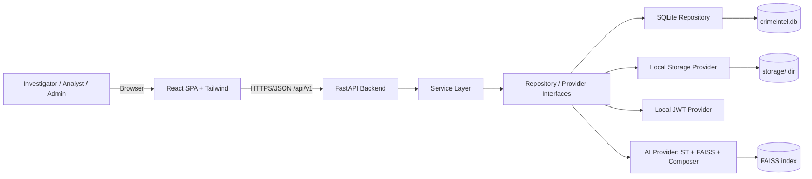
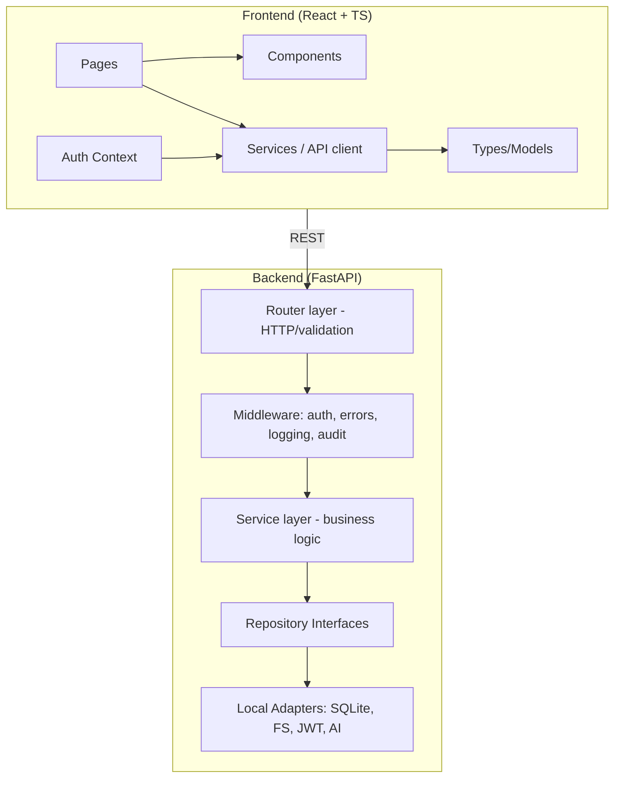
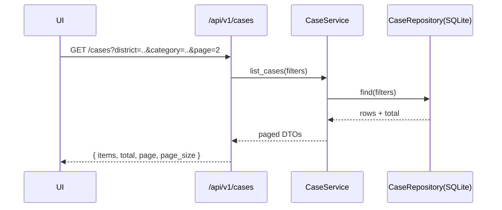
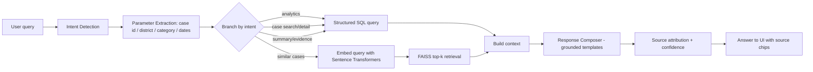
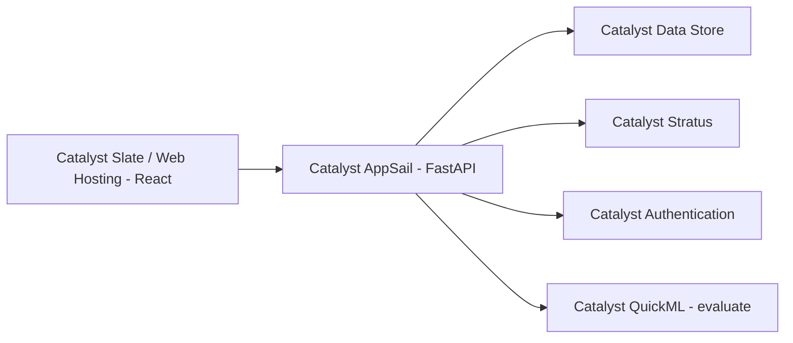
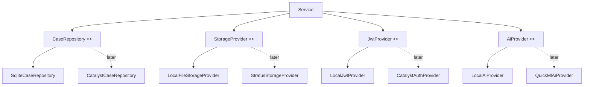

# ARCHITECTURE.md

> **CrimeIntel AI** — Team Pixel Pirates
> Status: Phase 0 — Foundation (design only, nothing implemented yet)

---

## 1. System Architecture



Local today. Later: replace the leaf nodes with Catalyst Data Store, Stratus, Catalyst Auth, QuickML — the interfaces stay.

## 2. Component Architecture



Ownership mapping: `ai/` (Eugene, CRIMA AI), `frontend/src/pages` for dashboard/cases (Dev 2), `backend/app/routers` auth/admin/evidence/reports (Dev 3).

## 3. Data Flow (typical requests)

**Case list (structured):**



**CRIMA AI query (semantic):** see Pipeline section below.

## 4. CRIMA AI Pipeline



Every branch returns **source records**; the composer cannot reference records that were not retrieved. Refusal path when zero matches.

## 5. Local Architecture

- Single machine: `scripts/dev.ps1`/`dev.sh` starts backend (uvicorn on :8000) and frontend (Vite on :5173, proxy `/api`).
- SQLite `data/crimeintel.db`, FAISS `data/indexes/cases.index`, uploads `storage/`.
- Embedding model cached under `~/.cache` (Hugging Face) — one-time download.
- No cloud account, no internet at runtime required.

## 6. Target Catalyst Architecture



FastAPI app is containerized/uploaded as-is; data store repository replaces SQLite repository via config switch.

## 7. Integration Points

| Interface | Local impl | Catalyst impl |
|---|---|---|
| `UserRepository`, `CaseRepository`, `EvidenceRepository`, `AuditLogRepository`, `ReportRepository`, `ConversationRepository` | SQLAlchemy/SQLite | Catalyst Data Store |
| `StorageProvider` (`put`, `get`, `delete`) | local filesystem | Stratus |
| `JwtProvider` (`issue`, `verify`) | PyJWT | Catalyst Auth |
| `AiProvider` (`embed`, `search`, `answer`) | ST + FAISS + composer | QuickML (evaluate) |

Configuration via `.env`: `DATABASE__PROVIDER=sqlite`, `STORAGE__PROVIDER=local`, `AUTH__PROVIDER=local`, `AI__PROVIDER=local`.

## 8. Adapter/Provider Architecture



Selection: a factory reads `*__PROVIDER` env vars and returns the correct implementation. **Services only ever see interfaces.**

## 9. Repository Structure (target)

```
CrimeIntelAI/
├── docs/            # source of truth (this document set)
├── frontend/        # React + TS + Tailwind
├── backend/         # FastAPI app
├── ai/              # CRIMA AI pipeline (embeddings, intent, retrieval, generation)
├── data/            # seed data, generated .db, FAISS indexes
├── storage/         # uploaded evidence (local FS)
├── scripts/         # setup, seed, dev, test helpers
├── tests/           # backend / AI / integration tests
└── .github/         # templates + CI (Phase 8+)
```

## 10. Current Implementation State

**Nothing is implemented.** This repository currently contains documentation and directory scaffolding only (Phase 0). See `ROADMAP.md` for what comes next.