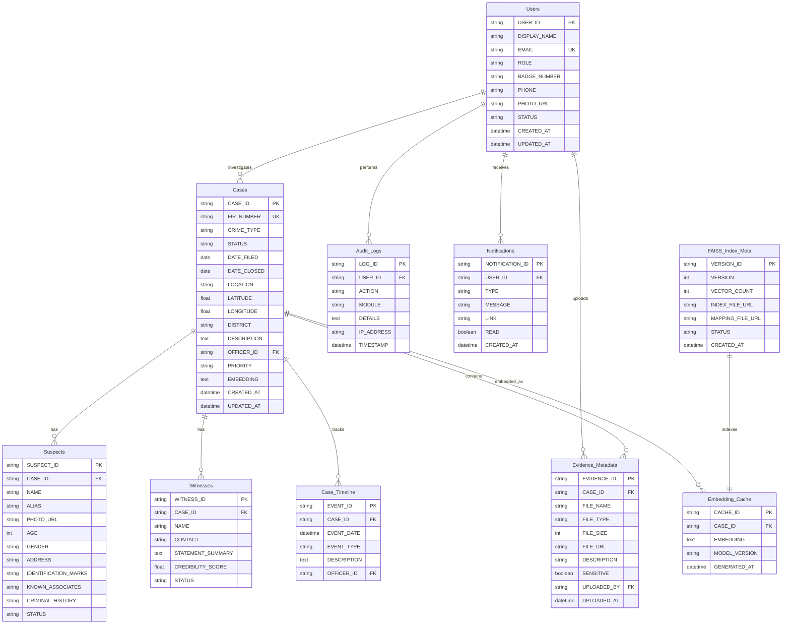

# DATABASE DESIGN

## CrimeIntel AI — Intelligent Conversational AI for KSP Crime Database

---

# TABLE OF CONTENTS

1. [ER Diagram](#1-er-diagram)
2. [Normalization (up to 3NF)](#2-normalization)
3. [Database Schema](#3-database-schema)
4. [Data Dictionary](#4-data-dictionary)
5. [Primary & Foreign Keys](#5-primary--foreign-keys)
6. [Constraints](#6-constraints)
7. [Indexes](#7-indexes)
8. [CRUD Matrix](#8-crud-matrix)
9. [Entity Relationships](#9-entity-relationships)
10. [Catalyst Data Store Mapping](#10-catalyst-data-store-mapping)

---

# 1. ER DIAGRAM



---

# 2. NORMALIZATION (up to 3NF)

## Unnormalized Form (UNF)

A single flat record containing all case information would have repeating groups (multiple suspects per case, multiple witnesses per case) and data redundancy (officer name repeated across cases).

## First Normal Form (1NF)

- Removed repeating groups by creating separate tables: Suspects, Witnesses, Evidence_Metadata, Case_Timeline
- Each table has a primary key
- All attributes are atomic (no arrays, no JSON strings for MVP — exception: KNOWN_ASSOCIATES uses JSON array, acceptable for NoSQL)

## Second Normal Form (2NF)

- All non-key attributes are fully functionally dependent on the primary key
- Cases table: CASE_ID determines all case attributes; no partial dependencies
- Suspects table: SUSPECT_ID determines suspect attributes; CASE_ID is foreign key only
- Audit_Logs: LOG_ID determines all log attributes; no partial dependency on USER_ID

## Third Normal Form (3NF)

- No transitive dependencies exist
- Cases: OFFICER_ID references Users (not storing officer name directly in Cases)
- Evidence_Metadata: UPLOADED_BY references Users (not storing uploader name directly)
- Case_Timeline: OFFICER_ID references Users
- All tables satisfy 3NF

### Normalization Summary

| Table | 1NF | 2NF | 3NF |
|---|---|---|---|
| Users | ✓ | ✓ | ✓ |
| Cases | ✓ | ✓ | ✓ |
| Suspects | ✓ | ✓ | ✓ |
| Witnesses | ✓ | ✓ | ✓ |
| Evidence_Metadata | ✓ | ✓ | ✓ |
| Case_Timeline | ✓ | ✓ | ✓ |
| Notifications | ✓ | ✓ | ✓ |
| Audit_Logs | ✓ | ✓ | ✓ |
| FAISS_Index_Meta | ✓ | ✓ | ✓ |
| Embedding_Cache | ✓ | ✓ | ✓ |

---

# 3. DATABASE SCHEMA

## Catalyst Data Store Tables

Catalyst Data Store is a NoSQL document store. Each table is created with a schema definition. The following is the canonical schema.

### Table: `ci_users`

```json
{
  "table_name": "ci_users",
  "primary_key": "USER_ID",
  "columns": {
    "USER_ID":        { "type": "STRING", "length": 36, "required": true },
    "DISPLAY_NAME":   { "type": "STRING", "length": 100, "required": true },
    "EMAIL":          { "type": "STRING", "length": 200, "required": true, "unique": true },
    "ROLE":           { "type": "STRING", "length": 20, "required": true },
    "BADGE_NUMBER":   { "type": "STRING", "length": 50 },
    "PHONE":          { "type": "STRING", "length": 20 },
    "PHOTO_URL":      { "type": "STRING", "length": 500 },
    "STATUS":         { "type": "STRING", "length": 20, "required": true },
    "CREATED_AT":     { "type": "DATETIME", "required": true },
    "UPDATED_AT":     { "type": "DATETIME", "required": true }
  }
}
```

### Table: `ci_cases`

```json
{
  "table_name": "ci_cases",
  "primary_key": "CASE_ID",
  "columns": {
    "CASE_ID":        { "type": "STRING", "length": 50, "required": true },
    "FIR_NUMBER":     { "type": "STRING", "length": 50, "required": true, "unique": true },
    "CRIME_TYPE":     { "type": "STRING", "length": 50, "required": true },
    "STATUS":         { "type": "STRING", "length": 30, "required": true },
    "DATE_FILED":     { "type": "DATE", "required": true },
    "DATE_CLOSED":    { "type": "DATE" },
    "LOCATION":       { "type": "STRING", "length": 200, "required": true },
    "LATITUDE":       { "type": "FLOAT" },
    "LONGITUDE":      { "type": "FLOAT" },
    "DISTRICT":       { "type": "STRING", "length": 100, "required": true },
    "DESCRIPTION":    { "type": "TEXT", "required": true },
    "OFFICER_ID":     { "type": "STRING", "length": 36, "required": true },
    "PRIORITY":       { "type": "STRING", "length": 20 },
    "EMBEDDING":      { "type": "TEXT" },
    "CREATED_AT":     { "type": "DATETIME", "required": true },
    "UPDATED_AT":     { "type": "DATETIME", "required": true }
  }
}
```

### Table: `ci_suspects`

```json
{
  "table_name": "ci_suspects",
  "primary_key": "SUSPECT_ID",
  "columns": {
    "SUSPECT_ID":           { "type": "STRING", "length": 36, "required": true },
    "CASE_ID":              { "type": "STRING", "length": 50, "required": true },
    "NAME":                 { "type": "STRING", "length": 150, "required": true },
    "ALIAS":                { "type": "STRING", "length": 150 },
    "PHOTO_URL":            { "type": "STRING", "length": 500 },
    "AGE":                  { "type": "INTEGER" },
    "GENDER":               { "type": "STRING", "length": 10 },
    "ADDRESS":              { "type": "STRING", "length": 500 },
    "IDENTIFICATION_MARKS": { "type": "STRING", "length": 500 },
    "KNOWN_ASSOCIATES":     { "type": "TEXT" },
    "CRIMINAL_HISTORY":     { "type": "TEXT" },
    "STATUS":               { "type": "STRING", "length": 30, "required": true }
  }
}
```

### Table: `ci_witnesses`

```json
{
  "table_name": "ci_witnesses",
  "primary_key": "WITNESS_ID",
  "columns": {
    "WITNESS_ID":        { "type": "STRING", "length": 36, "required": true },
    "CASE_ID":           { "type": "STRING", "length": 50, "required": true },
    "NAME":              { "type": "STRING", "length": 150, "required": true },
    "CONTACT":           { "type": "STRING", "length": 100 },
    "STATEMENT_SUMMARY": { "type": "TEXT" },
    "CREDIBILITY_SCORE": { "type": "FLOAT" },
    "STATUS":            { "type": "STRING", "length": 30, "required": true }
  }
}
```

### Table: `ci_evidence_metadata`

```json
{
  "table_name": "ci_evidence_metadata",
  "primary_key": "EVIDENCE_ID",
  "columns": {
    "EVIDENCE_ID":  { "type": "STRING", "length": 36, "required": true },
    "CASE_ID":      { "type": "STRING", "length": 50, "required": true },
    "FILE_NAME":    { "type": "STRING", "length": 255, "required": true },
    "FILE_TYPE":    { "type": "STRING", "length": 10, "required": true },
    "FILE_SIZE":    { "type": "INTEGER", "required": true },
    "FILE_URL":     { "type": "STRING", "length": 1000, "required": true },
    "DESCRIPTION":  { "type": "STRING", "length": 500 },
    "SENSITIVE":    { "type": "BOOLEAN" },
    "UPLOADED_BY":  { "type": "STRING", "length": 36, "required": true },
    "UPLOADED_AT":  { "type": "DATETIME", "required": true }
  }
}
```

### Table: `ci_case_timeline`

```json
{
  "table_name": "ci_case_timeline",
  "primary_key": "EVENT_ID",
  "columns": {
    "EVENT_ID":     { "type": "STRING", "length": 36, "required": true },
    "CASE_ID":      { "type": "STRING", "length": 50, "required": true },
    "EVENT_DATE":   { "type": "DATETIME", "required": true },
    "EVENT_TYPE":   { "type": "STRING", "length": 50, "required": true },
    "DESCRIPTION":  { "type": "TEXT", "required": true },
    "OFFICER_ID":   { "type": "STRING", "length": 36 }
  }
}
```

### Table: `ci_notifications`

```json
{
  "table_name": "ci_notifications",
  "primary_key": "NOTIFICATION_ID",
  "columns": {
    "NOTIFICATION_ID": { "type": "STRING", "length": 36, "required": true },
    "USER_ID":         { "type": "STRING", "length": 36, "required": true },
    "TYPE":            { "type": "STRING", "length": 50, "required": true },
    "MESSAGE":         { "type": "STRING", "length": 500, "required": true },
    "LINK":            { "type": "STRING", "length": 500 },
    "READ":            { "type": "BOOLEAN" },
    "CREATED_AT":      { "type": "DATETIME", "required": true }
  }
}
```

### Table: `ci_audit_logs`

```json
{
  "table_name": "ci_audit_logs",
  "primary_key": "LOG_ID",
  "columns": {
    "LOG_ID":      { "type": "STRING", "length": 36, "required": true },
    "USER_ID":     { "type": "STRING", "length": 36, "required": true },
    "ACTION":      { "type": "STRING", "length": 100, "required": true },
    "MODULE":      { "type": "STRING", "length": 50, "required": true },
    "DETAILS":     { "type": "TEXT" },
    "IP_ADDRESS":  { "type": "STRING", "length": 45 },
    "TIMESTAMP":   { "type": "DATETIME", "required": true }
  }
}
```

### Table: `ci_faiss_index_meta`

```json
{
  "table_name": "ci_faiss_index_meta",
  "primary_key": "VERSION_ID",
  "columns": {
    "VERSION_ID":      { "type": "STRING", "length": 36, "required": true },
    "VERSION":         { "type": "INTEGER", "required": true },
    "VECTOR_COUNT":    { "type": "INTEGER", "required": true },
    "INDEX_FILE_URL":  { "type": "STRING", "length": 1000, "required": true },
    "MAPPING_FILE_URL":{ "type": "STRING", "length": 1000, "required": true },
    "STATUS":          { "type": "STRING", "length": 20, "required": true },
    "CREATED_AT":      { "type": "DATETIME", "required": true }
  }
}
```

### Table: `ci_embedding_cache`

```json
{
  "table_name": "ci_embedding_cache",
  "primary_key": "CACHE_ID",
  "columns": {
    "CACHE_ID":      { "type": "STRING", "length": 36, "required": true },
    "CASE_ID":       { "type": "STRING", "length": 50, "required": true },
    "EMBEDDING":     { "type": "TEXT", "required": true },
    "MODEL_VERSION": { "type": "STRING", "length": 50, "required": true },
    "GENERATED_AT":  { "type": "DATETIME", "required": true }
  }
}
```

---

# 4. DATA DICTIONARY

### Table: `ci_users`

| Column | Type | Length | Required | Default | Description |
|---|---|---|---|---|---|
| USER_ID | STRING | 36 | Y | UUID4 | Primary key — unique user identifier |
| DISPLAY_NAME | STRING | 100 | Y | — | Full name of the officer |
| EMAIL | STRING | 200 | Y | — | Email address (login ID, unique) |
| ROLE | STRING | 20 | Y | "officer" | Enum: officer, inspector, admin, super_admin |
| BADGE_NUMBER | STRING | 50 | N | — | KSP badge/ID number |
| PHONE | STRING | 20 | N | — | Contact phone number |
| PHOTO_URL | STRING | 500 | N | — | Profile photo URL (File Store) |
| STATUS | STRING | 20 | Y | "active" | Enum: active, inactive, disabled |
| CREATED_AT | DATETIME | — | Y | now() | Row creation timestamp |
| UPDATED_AT | DATETIME | — | Y | now() | Row last-updated timestamp |

### Table: `ci_cases`

| Column | Type | Length | Required | Default | Description |
|---|---|---|---|---|---|
| CASE_ID | STRING | 50 | Y | Auto | Format: FIR-YYYY-NNNNNN |
| FIR_NUMBER | STRING | 50 | Y | — | Original FIR number (unique) |
| CRIME_TYPE | STRING | 50 | Y | — | Enum: theft, assault, murder, robbery, cybercrime, etc. |
| STATUS | STRING | 30 | Y | "open" | Enum: open, under_investigation, closed, filed |
| DATE_FILED | DATE | — | Y | — | Date FIR registered |
| DATE_CLOSED | DATE | — | N | — | Date case closed |
| LOCATION | STRING | 200 | Y | — | Crime location description |
| LATITUDE | FLOAT | — | N | — | Latitude for geolocation |
| LONGITUDE | FLOAT | — | N | — | Longitude for geolocation |
| DISTRICT | STRING | 100 | Y | — | District name |
| DESCRIPTION | TEXT | — | Y | — | FIR description / case narrative |
| OFFICER_ID | STRING | 36 | Y | — | FK → ci_users.USER_ID (investigating officer) |
| PRIORITY | STRING | 20 | N | "medium" | Enum: low, medium, high, critical |
| EMBEDDING | TEXT | — | N | — | JSON-serialized 384-dim vector |
| CREATED_AT | DATETIME | — | Y | now() | Row creation timestamp |
| UPDATED_AT | DATETIME | — | Y | now() | Row last-updated timestamp |

### Table: `ci_suspects`

| Column | Type | Length | Required | Default | Description |
|---|---|---|---|---|---|
| SUSPECT_ID | STRING | 36 | Y | UUID4 | Primary key |
| CASE_ID | STRING | 50 | Y | — | FK → ci_cases.CASE_ID |
| NAME | STRING | 150 | Y | — | Full name |
| ALIAS | STRING | 150 | N | — | Known aliases |
| PHOTO_URL | STRING | 500 | N | — | Suspect photo URL |
| AGE | INTEGER | — | N | — | Age |
| GENDER | STRING | 10 | N | — | Enum: male, female, other |
| ADDRESS | STRING | 500 | N | — | Residential address |
| IDENTIFICATION_MARKS | STRING | 500 | N | — | Scars, tattoos, etc. |
| KNOWN_ASSOCIATES | TEXT | — | N | — | JSON array of associate names |
| CRIMINAL_HISTORY | TEXT | — | N | — | Prior criminal record summary |
| STATUS | STRING | 30 | Y | "wanted" | Enum: wanted, arrested, released, convicted |

### Table: `ci_witnesses`

| Column | Type | Length | Required | Default | Description |
|---|---|---|---|---|---|
| WITNESS_ID | STRING | 36 | Y | UUID4 | Primary key |
| CASE_ID | STRING | 50 | Y | — | FK → ci_cases.CASE_ID |
| NAME | STRING | 150 | Y | — | Full name |
| CONTACT | STRING | 100 | N | — | Phone or email |
| STATEMENT_SUMMARY | TEXT | — | N | — | Key points from statement |
| CREDIBILITY_SCORE | FLOAT | — | N | 0.5 | Range 0.0–1.0 |
| STATUS | STRING | 30 | Y | "pending" | Enum: pending, recorded, verified |

### Table: `ci_evidence_metadata`

| Column | Type | Length | Required | Default | Description |
|---|---|---|---|---|---|
| EVIDENCE_ID | STRING | 36 | Y | UUID4 | Primary key |
| CASE_ID | STRING | 50 | Y | — | FK → ci_cases.CASE_ID |
| FILE_NAME | STRING | 255 | Y | — | Original filename |
| FILE_TYPE | STRING | 10 | Y | — | Enum: pdf, jpeg, png, mp4 |
| FILE_SIZE | INTEGER | — | Y | — | Size in bytes |
| FILE_URL | STRING | 1000 | Y | — | Full File Store URL |
| DESCRIPTION | STRING | 500 | N | — | Evidence description |
| SENSITIVE | BOOLEAN | — | N | false | Restricted access flag |
| UPLOADED_BY | STRING | 36 | Y | — | FK → ci_users.USER_ID |
| UPLOADED_AT | DATETIME | — | Y | now() | Upload timestamp |

### Table: `ci_case_timeline`

| Column | Type | Length | Required | Default | Description |
|---|---|---|---|---|---|
| EVENT_ID | STRING | 36 | Y | UUID4 | Primary key |
| CASE_ID | STRING | 50 | Y | — | FK → ci_cases.CASE_ID |
| EVENT_DATE | DATETIME | — | Y | — | When the event occurred |
| EVENT_TYPE | STRING | 50 | Y | — | Enum: fir_registered, suspect_identified, etc. |
| DESCRIPTION | TEXT | — | Y | — | Event description |
| OFFICER_ID | STRING | 36 | N | — | FK → ci_users.USER_ID |

### Table: `ci_notifications`

| Column | Type | Length | Required | Default | Description |
|---|---|---|---|---|---|
| NOTIFICATION_ID | STRING | 36 | Y | UUID4 | Primary key |
| USER_ID | STRING | 36 | Y | — | FK → ci_users.USER_ID |
| TYPE | STRING | 50 | Y | — | Enum: case_assigned, status_change, etc. |
| MESSAGE | STRING | 500 | Y | — | Notification body text |
| LINK | STRING | 500 | N | — | Deep link URL |
| READ | BOOLEAN | — | N | false | Read/unread flag |
| CREATED_AT | DATETIME | — | Y | now() | Creation timestamp |

### Table: `ci_audit_logs`

| Column | Type | Length | Required | Default | Description |
|---|---|---|---|---|---|
| LOG_ID | STRING | 36 | Y | UUID4 | Primary key |
| USER_ID | STRING | 36 | Y | — | FK → ci_users.USER_ID |
| ACTION | STRING | 100 | Y | — | Action performed |
| MODULE | STRING | 50 | Y | — | Module name |
| DETAILS | TEXT | — | N | — | JSON context payload |
| IP_ADDRESS | STRING | 45 | N | — | Client IP |
| TIMESTAMP | DATETIME | — | Y | now() | Action timestamp |

### Table: `ci_faiss_index_meta`

| Column | Type | Length | Required | Default | Description |
|---|---|---|---|---|---|
| VERSION_ID | STRING | 36 | Y | UUID4 | Primary key |
| VERSION | INTEGER | — | Y | — | Sequential version number |
| VECTOR_COUNT | INTEGER | — | Y | — | Number of indexed vectors |
| INDEX_FILE_URL | STRING | 1000 | Y | — | FAISS index file URL |
| MAPPING_FILE_URL | STRING | 1000 | Y | — | ID-to-CaseID mapping JSON URL |
| STATUS | STRING | 20 | Y | "building" | Enum: building, ready, failed |
| CREATED_AT | DATETIME | — | Y | now() | Creation timestamp |

### Table: `ci_embedding_cache`

| Column | Type | Length | Required | Default | Description |
|---|---|---|---|---|---|
| CACHE_ID | STRING | 36 | Y | UUID4 | Primary key |
| CASE_ID | STRING | 50 | Y | — | FK → ci_cases.CASE_ID |
| EMBEDDING | TEXT | — | Y | — | JSON array of 384 floats |
| MODEL_VERSION | STRING | 50 | Y | "all-MiniLM-L6-v2" | Model identifier |
| GENERATED_AT | DATETIME | — | Y | now() | Generation timestamp |

---

# 5. PRIMARY & FOREIGN KEYS

| Table | Primary Key | Foreign Keys | References |
|---|---|---|---|
| ci_users | USER_ID | — | — |
| ci_cases | CASE_ID | OFFICER_ID | ci_users.USER_ID |
| ci_suspects | SUSPECT_ID | CASE_ID | ci_cases.CASE_ID |
| ci_witnesses | WITNESS_ID | CASE_ID | ci_cases.CASE_ID |
| ci_evidence_metadata | EVIDENCE_ID | CASE_ID, UPLOADED_BY | ci_cases.CASE_ID, ci_users.USER_ID |
| ci_case_timeline | EVENT_ID | CASE_ID, OFFICER_ID | ci_cases.CASE_ID, ci_users.USER_ID |
| ci_notifications | NOTIFICATION_ID | USER_ID | ci_users.USER_ID |
| ci_audit_logs | LOG_ID | USER_ID | ci_users.USER_ID |
| ci_faiss_index_meta | VERSION_ID | — | — |
| ci_embedding_cache | CACHE_ID | CASE_ID | ci_cases.CASE_ID |

## Unique Keys (Alternate Keys)

| Table | Column(s) | Constraint |
|---|---|---|
| ci_users | EMAIL | Unique |
| ci_cases | FIR_NUMBER | Unique |
| ci_cases | CASE_ID | Unique (PK) |
| ci_embedding_cache | CASE_ID | Unique (one embedding per case) |

---

# 6. CONSTRAINTS

| Constraint Type | Table | Column | Rule |
|---|---|---|---|
| NOT NULL | All PK columns | — | All primary keys required |
| UNIQUE | ci_users | EMAIL | Duplicate emails not allowed |
| UNIQUE | ci_cases | FIR_NUMBER | Duplicate FIR numbers not allowed |
| CHECK (app-level) | ci_users | ROLE | IN ('officer', 'inspector', 'admin', 'super_admin') |
| CHECK (app-level) | ci_cases | STATUS | IN ('open', 'under_investigation', 'closed', 'filed') |
| CHECK (app-level) | ci_cases | CRIME_TYPE | IN ('theft', 'assault', 'murder', 'robbery', 'cybercrime', 'fraud', 'kidnapping', 'rioting', 'dacoity', 'other') |
| CHECK (app-level) | ci_cases | PRIORITY | IN ('low', 'medium', 'high', 'critical') |
| CHECK (app-level) | ci_evidence_metadata | FILE_TYPE | IN ('pdf', 'jpeg', 'png', 'mp4') |
| CHECK (app-level) | ci_evidence_metadata | FILE_SIZE | ≤ 26214400 (25 MB) |
| CHECK (app-level) | ci_witnesses | CREDIBILITY_SCORE | BETWEEN 0.0 AND 1.0 |
| CHECK (app-level) | ci_users | STATUS | IN ('active', 'inactive', 'disabled') |
| CHECK (app-level) | ci_suspects | STATUS | IN ('wanted', 'arrested', 'released', 'convicted') |
| CHECK (app-level) | ci_witnesses | STATUS | IN ('pending', 'recorded', 'verified') |

---

# 7. INDEXES

Catalyst Data Store has limited indexing. The following indexes are defined at the application level (query optimization):

| Table | Index Column(s) | Type | Purpose |
|---|---|---|---|
| ci_cases | CRIME_TYPE | Application-level filter | Filter cases by crime type |
| ci_cases | STATUS | Application-level filter | Filter by case status |
| ci_cases | DISTRICT | Application-level filter | Filter by district |
| ci_cases | DATE_FILED | Application-level sort | Sort by date |
| ci_cases | OFFICER_ID | Application-level filter | Get officer's cases |
| ci_cases | LOCATION | Application-level search | Text search on location |
| ci_cases | DESCRIPTION | Application-level search | Text search on FIR text |
| ci_suspects | NAME | Application-level search | Search suspects by name |
| ci_suspects | CASE_ID | Application-level filter | Get suspects for a case |
| ci_witnesses | CASE_ID | Application-level filter | Get witnesses for a case |
| ci_evidence_metadata | CASE_ID | Application-level filter | Get evidence for a case |
| ci_notifications | USER_ID | Application-level filter | Get user's notifications |
| ci_notifications | READ | Application-level filter | Filter unread |
| ci_audit_logs | USER_ID | Application-level filter | Filter by user |
| ci_audit_logs | TIMESTAMP | Application-level sort | Sort by time |
| ci_audit_logs | MODULE | Application-level filter | Filter by module |

**Note:** Since Catalyst Data Store is NoSQL, these indexes are implemented as application-level query filters. For MVP scale (<10K records), full scans with application-side filtering are acceptable.

---

# 8. CRUD MATRIX

| Entity | Create | Read | Update | Delete | Who Can Create | Who Can Delete |
|---|---|---|---|---|---|---|
| Users | Admin+ | Self, Admin+ | Self, Admin+ | Super Admin | Admin | Super Admin |
| Cases | Inspector+ | All | Inspector+ | Admin+ | Inspector+ | Admin+ |
| Suspects | Inspector+ | All | Inspector+ | Admin+ | Inspector+ | Admin+ |
| Witnesses | Inspector+ | All | Inspector+ | Admin+ | Inspector+ | Admin+ |
| Evidence | Officer+ | All (sensitive: Inspector+) | Inspector+ | Inspector+ | Officer+ | Inspector+ |
| Case Timeline | Inspector+ (auto) | All | Inspector+ | System | System / Inspector | System |
| Notifications | System | Self | Self (mark read) | System | System | System |
| Audit Logs | System | Admin+ | None (append-only) | None | System | None |
| FAISS Index Meta | System | System | System | System | Indexer | System |
| Embedding Cache | System | System | System | System | Indexer | System |

## CRUD Definitions

| Operation | Meaning |
|---|---|
| Create | INSERT new row |
| Read | SELECT / GET row(s) |
| Update | UPDATE existing row (partial or full) |
| Delete | Soft-delete (set STATUS to 'deleted' or 'inactive') — no hard deletes except Admin+ |

---

# 9. ENTITY RELATIONSHIPS

## Relationship Summary

| Parent | Child | Relationship | Cardinality | Description |
|---|---|---|---|---|
| Users | Cases | One-to-Many | 1 Users : N Cases | An officer investigates many cases |
| Users | Audit_Logs | One-to-Many | 1 Users : N Logs | A user performs many actions |
| Users | Notifications | One-to-Many | 1 Users : N Notifications | A user receives many notifications |
| Users | Evidence_Metadata | One-to-Many | 1 Users : N Evidence | A user uploads many evidence files |
| Cases | Suspects | One-to-Many | 1 Cases : N Suspects | A case has multiple suspects |
| Cases | Witnesses | One-to-Many | 1 Cases : N Witnesses | A case has multiple witnesses |
| Cases | Case_Timeline | One-to-Many | 1 Cases : N Events | A case has many timeline events |
| Cases | Evidence_Metadata | One-to-Many | 1 Cases : N Evidence | A case contains many evidence items |
| Cases | Embedding_Cache | One-to-One | 1 Cases : 1 Embedding | Each case has one embedding vector |
| Embedding_Cache | FAISS_Index_Meta | Many-to-One | N Embeddings : 1 Index | Many embeddings belong to one index version |

---

# 10. CATALYST DATA STORE MAPPING

## Table Naming Convention

```
ci_{entity_name}
```

- `ci` prefix = CrimeIntel
- Snake case for readability in NoSQL context
- All capitals for column names (consistent with Data Store SDK)

## Catalyst SDK Usage

```python
# Pseudocode for adapter layer
from catalyst_vo import DataStore

class CatalystDB:
    def __init__(self):
        self.client = DataStore.getInstance()

    async def get(self, table: str, row_id: str) -> dict:
        return self.client.getRow(table, row_id)

    async def insert(self, table: str, data: dict) -> str:
        return self.client.insertRow(table, data)

    async def update(self, table: str, row_id: str, data: dict) -> None:
        self.client.updateRow(table, row_id, data)

    async def delete(self, table: str, row_id: str) -> None:
        self.client.deleteRow(table, row_id)

    async def get_all(self, table: str) -> list:
        return self.client.getAllRows(table)
```

---

# END OF DATABASE DESIGN
