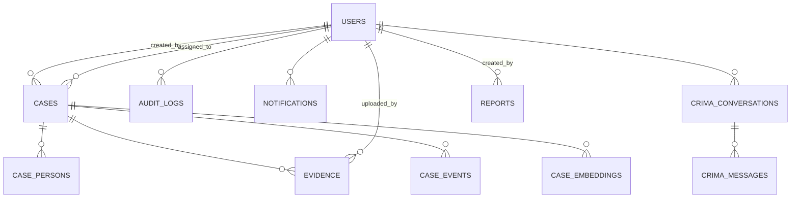

# DATABASE_SCHEMA.md

> **CrimeIntel AI** — prototype database design (SQLite local; mapping to Catalyst Data Store later)
> Status: Phase 0 — design only, no implementation yet

---

## 1. Conventions

- SQLite + SQLAlchemy 2.x ORM; WAL mode; `PRAGMA foreign_keys = ON`.
- Timestamps stored as ISO-8601 UTC text (`created_at`, `updated_at`).
- Booleans as INTEGER `0/1`; soft deletes avoided at MVP (hard delete + audit log).
- Every table has `id INTEGER PRIMARY KEY AUTOINCREMENT` unless noted.
- Indexes on all foreign keys and filter columns.
- Only synthetic data ever lives in this database.

## 2. Entity Relationship Diagram

## 3. Tables

### 3.1 users

| Column | Type | Constraints | Notes |
|---|---|---|---|
| id | INTEGER | PK | |
| username | TEXT | UNIQUE NOT NULL | login id |
| full_name | TEXT | NOT NULL | |
| email | TEXT | UNIQUE NOT NULL | |
| password_hash | TEXT | NOT NULL | bcrypt |
| role | TEXT | NOT NULL DEFAULT 'investigator' | `admin` `investigator` `analyst` `viewer` |
| is_active | INTEGER | NOT NULL DEFAULT 1 | |
| last_login_at | TEXT | | |
| created_at | TEXT | NOT NULL | |
| updated_at | TEXT | NOT NULL | |

### 3.2 cases

| Column | Type | Constraints | Notes |
|---|---|---|---|
| id | INTEGER | PK | |
| case_number | TEXT | UNIQUE NOT NULL | e.g. `CASE-1024` |
| title | TEXT | NOT NULL | short headline |
| description | TEXT | NOT NULL | narrative |
| category | TEXT | NOT NULL | `theft` `burglary` `robbery` `vehicle_theft` `assault` `cybercrime` `fraud` `missing_person` `drug_related` `murder` `other` |
| district | TEXT | NOT NULL | Karnataka district |
| locality | TEXT | | area/street (synthetic) |
| status | TEXT | NOT NULL DEFAULT 'open' | `open` `under_investigation` `closed` `archived` |
| priority | TEXT | NOT NULL DEFAULT 'medium' | `low` `medium` `high` `critical` |
| reported_at | TEXT | NOT NULL | |
| occurred_at | TEXT | NOT NULL | |
| resolved_at | TEXT | | set when closed |
| created_by | INTEGER | FK → users.id NOT NULL | |
| assigned_to | INTEGER | FK → users.id | nullable |
| created_at | TEXT | NOT NULL | |
| updated_at | TEXT | NOT NULL | |

Indexes: `idx_cases_district(district)`, `idx_cases_category(category)`, `idx_cases_status(status)`, `idx_cases_occurred(occurred_at)`, `idx_cases_created_by`, `idx_cases_assigned_to`.

### 3.3 case_persons (suspects / victims / witnesses in one normalized table)

| Column | Type | Constraints | Notes |
|---|---|---|---|
| id | INTEGER | PK | |
| case_id | INTEGER | FK → cases.id ON DELETE CASCADE NOT NULL | |
| role | TEXT | NOT NULL | `suspect` `victim` `witness` |
| full_name | TEXT | NOT NULL | synthetic name |
| alias | TEXT | | |
| age | INTEGER | | |
| gender | TEXT | | |
| contact | TEXT | | synthetic only, never real |
| address | TEXT | | synthetic |
| statement | TEXT | | |
| notes | TEXT | | |
| status | TEXT | | e.g. `arrested` `wanted` for suspects |
| created_at / updated_at | TEXT | NOT NULL | |

Index: `idx_case_persons_case(case_id)`.

### 3.4 evidence

| Column | Type | Constraints | Notes |
|---|---|---|---|
| id | INTEGER | PK | |
| case_id | INTEGER | FK → cases.id ON DELETE CASCADE NOT NULL | |
| name | TEXT | NOT NULL | |
| description | TEXT | | |
| evidence_type | TEXT | NOT NULL | `document` `image` `audio` `video` `object` `other` |
| storage_path | TEXT | NOT NULL | local path or Stratus object key |
| file_size | INTEGER | | bytes |
| mime_type | TEXT | | |
| uploaded_by | INTEGER | FK → users.id NOT NULL | |
| created_at / updated_at | TEXT | NOT NULL | |

Index: `idx_evidence_case(case_id)`.

### 3.5 case_events (timeline)

| Column | Type | Constraints | Notes |
|---|---|---|---|
| id | INTEGER | PK | |
| case_id | INTEGER | FK → cases.id ON DELETE CASCADE NOT NULL | |
| user_id | INTEGER | FK → users.id NOT NULL | actor |
| event_type | TEXT | NOT NULL | `case_created` `status_changed` `note_added` `person_added` `evidence_added` `case_closed` |
| description | TEXT | NOT NULL | |
| occurred_at | TEXT | NOT NULL | |
| created_at | TEXT | NOT NULL | |

Index: `idx_case_events_case(case_id)`.

### 3.6 audit_logs

| Column | Type | Constraints | Notes |
|---|---|---|---|
| id | INTEGER | PK | |
| user_id | INTEGER | FK → users.id | nullable (system) |
| action | TEXT | NOT NULL | `login` `logout` `create` `update` `delete` `download` `ai_query` |
| entity_type | TEXT | NOT NULL | `case` `evidence` `user` `report` `settings` `crima` |
| entity_id | INTEGER | | |
| details | TEXT | | JSON |
| ip_address | TEXT | | |
| created_at | TEXT | NOT NULL | |

Index: `idx_audit_created(created_at)`, `idx_audit_user(user_id)`.

### 3.7 notifications

| Column | Type | Constraints | Notes |
|---|---|---|---|
| id | INTEGER | PK | |
| user_id | INTEGER | FK → users.id NOT NULL | |
| title / message | TEXT | NOT NULL | |
| notification_type | TEXT | NOT NULL | `case_assignment` `report_ready` `system` |
| is_read | INTEGER | NOT NULL DEFAULT 0 | |
| created_at | TEXT | NOT NULL | |

### 3.8 reports

| Column | Type | Constraints | Notes |
|---|---|---|---|
| id | INTEGER | PK | |
| title | TEXT | NOT NULL | |
| report_type | TEXT | NOT NULL | `case_summary` `analytics_snapshot` `district_summary` |
| params | TEXT | | JSON filters used |
| file_path | TEXT | | generated file |
| created_by | INTEGER | FK → users.id NOT NULL | |
| status | TEXT | NOT NULL DEFAULT 'generating' | `generating` `ready` `failed` |
| created_at | TEXT | NOT NULL | |
| completed_at | TEXT | | |

### 3.9 crima_conversations

| Column | Type | Constraints | Notes |
|---|---|---|---|
| id | INTEGER | PK | |
| user_id | INTEGER | FK → users.id NOT NULL | |
| title | TEXT | | auto from first query |
| created_at / updated_at | TEXT | NOT NULL | |

### 3.10 crima_messages

| Column | Type | Constraints | Notes |
|---|---|---|---|
| id | INTEGER | PK | |
| conversation_id | INTEGER | FK → crima_conversations.id ON DELETE CASCADE NOT NULL | |
| role | TEXT | NOT NULL | `user` `assistant` |
| content | TEXT | NOT NULL | |
| intent | TEXT | | detected intent |
| confidence | REAL | | 0–1 |
| sources | TEXT | | JSON array `[{case_id, case_number, title, score}]` |
| feedback | INTEGER | | `1` `-1` `NULL` |
| created_at | TEXT | NOT NULL | |

### 3.11 case_embeddings (FAISS mapping)

| Column | Type | Constraints | Notes |
|---|---|---|---|
| id | INTEGER | PK | **equals FAISS vector id** |
| case_id | INTEGER | FK → cases.id ON DELETE CASCADE UNIQUE NOT NULL | |
| embedding_model | TEXT | NOT NULL | e.g. `sentence-transformers/all-MiniLM-L6-v2` |
| updated_at | TEXT | NOT NULL | |

## 4. Relationships Summary

- users 1—N cases (created_by / assigned_to)
- cases 1—N case_persons, evidence, case_events, case_embeddings
- users 1—N evidence (uploaded_by), audit_logs, notifications, reports, crima_conversations
- crima_conversations 1—N crima_messages

## 5. Synthetic Data Strategy

- Generator: `scripts/generate_synthetic_data.py` (deterministic, seeded RNG).
- Volume: **≥ 300 cases** across 12 Karnataka districts, 10 categories.
- Distributions skewed realistically (vehicle_theft/theft heaviest in Bengaluru Urban).
- Persons: clearly fictional names (e.g. "R. Raghavendra"), fake contact numbers, fictional addresses — **no real personal information, no real case numbers**.
- Each case: 0–4 suspects, 0–3 victims, 0–3 witnesses, 1–8 evidence records, 2–10 timeline events.
- Evidence files: generated placeholder files (small text/PDF/JPEG placeholders).
- 6 users (2 admin, 2 investigator, 1 analyst, 1 viewer), audit log entries, 1 demo CRIMA conversation.
- Output: `data/seed/*.json` (source of truth for seed) + `data/crimeintel.db` (generated, gitignored).

## 6. Data Files (repo)

| Path | Content | Git |
|---|---|---|
| `data/seed/*.json` | deterministic seed definitions | committed |
| `data/crimeintel.db` | generated SQLite DB | ignored |
| `data/indexes/cases.index` | generated FAISS index | ignored |
| `storage/**` | generated/uploaded files | ignored |
